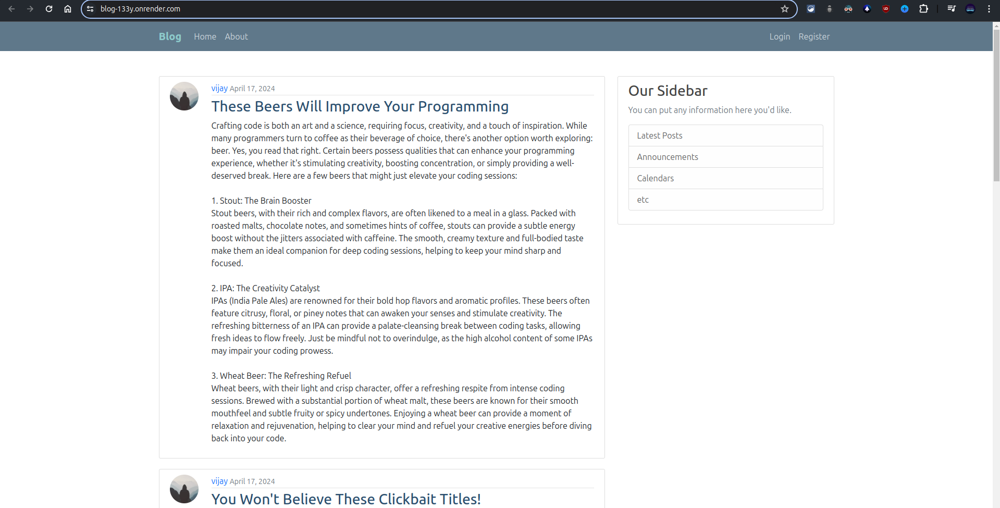

# Blog Project
The Blog Project is a feature-rich web application that allows users to create, read, update, and delete blog posts. Additionally, users can edit their profile images and details to personalize their accounts.
Explore the <a href="https://blog-133y.onrender.com/"> Blog </a> website.

## Features
- Robust CRUD (Create, Read, Update, Delete) interface for blogs
- User profile management including profile image and details editing

## Tech Stack
- Django
- Django ORM
- PostgreSQL
## Screenshots


## Local Installation

1. **Clone the Repository**
   ```shell
   git clone https://github.com/durgeshmehar/Blog.git
2. **Create and Activate a Virtual Environment**
   ```shell
   python -m venv venv
   source venv/bin/activate  # On Windows use `venv\Scripts\activate
    ```
3. **Install the Dependencies**
   ```shell
   cd Blog/mysite
   pip install -r requirements.txt
   ```
4. **Run the Development Server**
  ```shell
   python manage.py runserver
  ```
## Usage
1. Ensure the development server is running.
2. Open your browser and navigate to http://localhost:8000 to access the Blog application.
## Contributing
Contributions are welcome! Please fork the repository and create a pull request with your changes.
   
